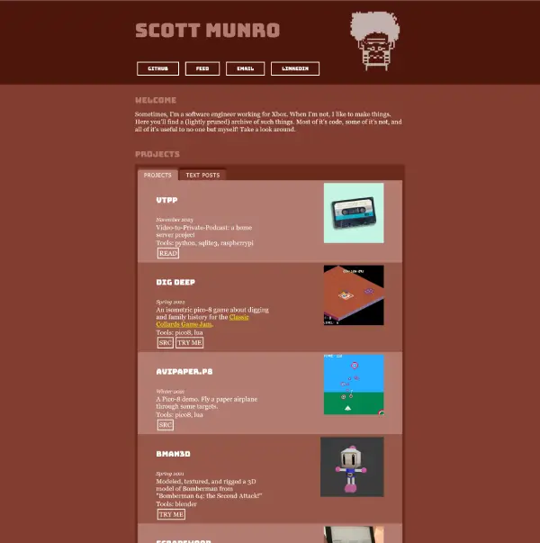

# 2024 Site Redesign

I started redesigning my site at the end of 2023 and wrapped up right at the start of 2024.

You can see an archive of [the old homepage on the Wayback Machine](https://web.archive.org/web/20231221220921/https://www.scottnm.com/).

## Why?

There were a lot of things which I liked about the old site:

* its visual uniqueness
* the monochromatic rust/red color scheme 
* the front-and-center-ness of the images on the site. 
* the page was static but all the content was populated with client-side vanilla JavaScript templating which made iterating and adding content very quick!
    * I did a bit of work that I'm proud of to make appropriate use of JavaScript without relying on a bunch of web dev tools that bog down day-to-day development (bundlers, transpilers, local HTTP servers, etc)
* it was easily archived with the [Wayback Machine](https://web.archive.org/)
    * I'm not sure why this was so important to me. Usually web archival tools are most appropriate for when you don't own the page in question. For some reason, it gives me comfort to know its a little more resilient to disappearing forever.

But it wasn't without its flaws:

* The large number of images impacted page load speed
    * Given its a static site, I've always felt like it has to be a goal that the page loads quickly
    * I tried several "easy" tricks to improve this (deferred image loads, reduced image size/quality, etc) which worked to some but not total success.
* The site relied on GoogleFonts for visual flair but these impacted page load speed
* I never quite achieved the page structure/layout I had in my head.
    * This is mostly an admission that I'm not a very good web developer and the CSS styling required to gridded structures still very much confuses me.
    * I also struggled with placing images within those grids at the right place and size.
* My page's structure/layout was designed for desktop and it didn't translate well to mobile
    * Images felt cramped.
    * Margins and padding always felt off compared to the desktop variant.
    * I tried to use responsive CSS media queries to change the styles based on the client's device, but it always felt like trying to force the desktop design to work on mobile with very poor compromise.
* I got it working but enabling the page to be "Wayback Machine" compatible required some compromises in my client-side JavaScript (everything was crammed in one mega-file)
* For simplicity, I never removed old page content (which lived in the JavaScript). I mostly just commented it out so it was easy to bring back without trawling through git history. But it bothered me that I was wasting bandwidth on dead data.
    * Using a minifier would have helped here but I always appreciated that my site was legible in the browser inspector. There were other ways I could have addressed this (some of which I did as part of this site redesign!) so I'm mostly stating that it was a pet peeve I kept punting to the future.

I tried to address some of these pain points individually without doing a full redesign, but I always struggled to fix "just one thing." For every "one thing" I fixed, it felt like "one step forward, two steps back", and, that feeling is hard to ignore when you're focused on the one thing. On the contrary, starting from basically nothing, everything felt like progress and comparisons between what I was gaining and what I was losing felt less obvious. Feels weird to admit having to trick myself to get work done (and those "tricks" probably costing me more time in the long-term), but eh I'm human, at least it got done, and the wasted time isn't the end of the world.

## What's changed?

The most noticeable change is in the layout and theme.

* The red-rust monochromatic colors have been replaced with simpler (and better contrasting) black-and-white
    * Honestly, this one's a bit bitter-sweet. I like the new colors, but I think it has less personality and I'm still interested in finding something more eye-catching than black and white. 
* The new layout adapts better between mobile and desktop. There's less distinct elements taking up the same horizontal space so all that really changes between mobile and desktop is the padding and margins around the core site content. Put another way, I restrained myself from overdoing it with grids.
* The new layout also improves performance by only using images for items in the "highlights" section (rather than for every project and text post).
* I'm now only relying on "web safe" fonts. I think this runs the risk of robbing my site of personality, but so far I like how things look. And while the fonts I'm using aren't 100% guaranteed to be available on all browsers forever in perpetuity, I think things feel abstractly safer than relying on fonts delivered remotely via CDN.

On the "authoring and development" side, things have also changed such that I'm no longer relying on client-side JavaScript to populate the page content at runtime. I do the more obvious and only slightly less dev friendly strategy of just using templates to build the HTML up-front and avoid JavaScript all together.

## Results

In general, I'm pretty happy with how things turned out. The mobile experience is significantly better. The homepage loads faster. There's fewer external dependencies. It still archives well [on the Wayback Machine](http://web.archive.org/web/20240113192350/https://www.scottnm.com/).

There's still room for improvement in the future (notably the colors), but for now I'm calling it complete.

## Shout-outs

I took meaningful inspiration from a few sites when re-designing my own. In no particular order:

* [scattered-thoughts.net](https://www.scattered-thoughts.net/) (Jamie Brandon)
* [fabiensanglard.net](https://fabiensanglard.net/) (Fabien Sanglard)
* [jvns.ca](https://jvns.ca/) (Julia Evans)

Thank you!
