# Dig Deep Dev Retrospective

This past March, I helped host and participated in a 2 week Game Jam: [The Classic Collards Jam](https://itch.io/jam/culture-bytes-classic-collards-jam).

My team built an isometric digging game in pico-8 called [Dig Deep](https://scottnm.itch.io/dig-deep).

I had an absurd amount of fun and felt like I grew a lot as a hobbyist game dev from the experience.

I really wanted to write some sort of cool, formal "dev retrospective" thing where I gave a well-structured breakdown of everything I learned and experienced during the jam. Ya know, really sit down and reflect on everything with an intention of taking all those lessons and using them to build something even cooler next time!... But, I've been slow to write it so my memory is getting hazy and my motivation has plummeted.

Shame shame shame on me.

In an attempt to half-assedly salvage this, I'm instead going to jot down a simple, contextless bulleted list of takeaways that are still semi-fresh in my memory. Without further ado, here we goooooooo...

* I'm very proud of how "complete" our submission felt. The game was end-to-end playable, we had music, we had no placeholder art, and we even had a proper ending with story text. Something that feels this close to "complete" was a new jam experience for me.
* Knowing how long to spend on initial design is tough. We spent our first two (of fourteen) days coming up with an initial idea. I really wanted to start iterating as quickly as possible and find out what was fun by playtesting rather than just thinking about it and even two days felt like we might be spending too much time "thinking about it". On the other hand, it takes just as long to build a bad game as a good game so its not like the design phase isn't time well spent. It's certainly a tricky balance, especially for a game jam.
* I think designing was easier once we established what our limitations and constraints were. Some constraints were self-imposed, but many of them were imposed by working in Pico-8. Once we had a much narrower design space, ideas flowed more naturally. Our constraints were:
    1. Complex physics and collision are a no-go. Pico-8 basically makes you implement everything but the sprite and audio renderer yourself.
    2. Pico-8 forces you to make very real tradeoffs between in-game text and code you can write. In-game text is a very scarce resource. Use it carefully, use it wisely.
    3. The game had to be playable with only 6 buttons. I am still shocked at how many interesting game ideas this constraint banished to scrap pile.
    4. We have limited time to test our game and basically no ways to automate testing so games need to be easily testable. The best way to keep things testable was to keep design simple. Reduce "if-this-then-that" ideas where possible.
* Doing this Game Jam with a team was a such an amazing experience. I may never go back to solo jamming.
* I like to fool myself into thinking I can pickup slack from other areas of the project (art, sfx, music) in addition to my programming duties. I cannot and I've gotta stop pretending. Leaning on others made all the difference in this jam.
* When working on a team, defining shared processes and strategies early on is very important. Our processes felt like they developed over time and so ended up feeling more isolated and confusing. I think we could have improved this coordination.
* Pico-8 feels ideal for solo work. Multiple people working on the same cart felt clunkier for all non-code assets.
* My rough, back-of-hand estimates suggest I worked 60-70 hours on this jam. Roughly 3-4 hours a night on weekdays and at least 8 hours a day on weekends. I think that number is a little high for my taste. It's not clear where/how I would reclaim time (smaller designs, better tools, demanding less of myself, etc)
* Pico-8's export tools are awesome and way more powerful than I first understood. Generating an HTML5 web version and standalone PC executables was trivial.
* Pico-8's screenshoting and gif recording tools was super useful for our remote Game Jam. I shared so many gif screen captures to get feedback on in-progress features.
* Pico-8's cart size limitations don't hit you until late in the game and when they do they hit you **hard**. This is specifically troublesome for a game jam where the late-game is where you really start scrambling. It sucks to know what you need to do but to just be straight up out of cart space.
* I refuse to write unreadably terse, comment-less code and Pico-8 is more than happy to punish me for this.
* I wasn't comfortable using Pico-8's map editor for laying out levels and I think that showed and cost us in the long run.
* I'm really happy with the isometric look we achieved in the game.
* I'm proud of the janky way I implemented movement, collision, and hitboxes for the isometric view.
* ["Lessons Learned Making Gunpoint Quickly Without Going Mad"](https://www.youtube.com/watch?v=aXTOUnzNo64) is an awesome GDC talk that I wish I had watched before the jam. The "easy-to-implement vs fun-to-play" matrix for determining whether to implement a feature is a great idea for game jams.

...and I think that's about all I've got.

One cool consequence of working in Pico-8 was that I had to make frequent use of its gif capture tool to share progress with my team as I was working on new features. Almost by accident, I ended up capturing effectively the entire development history of the project in gifs. Here they are! I think it looks pretty cool.

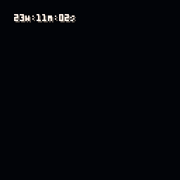

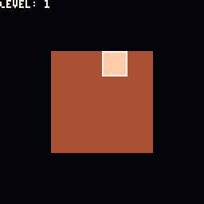

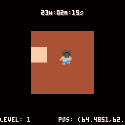
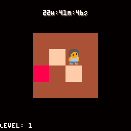
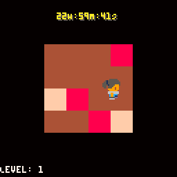
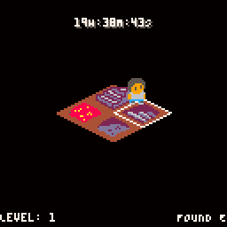
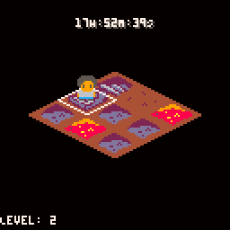
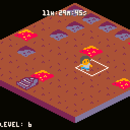

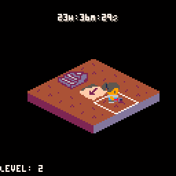

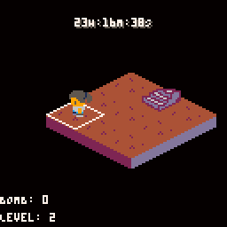
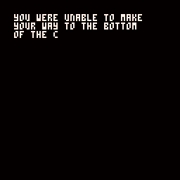

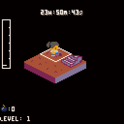
