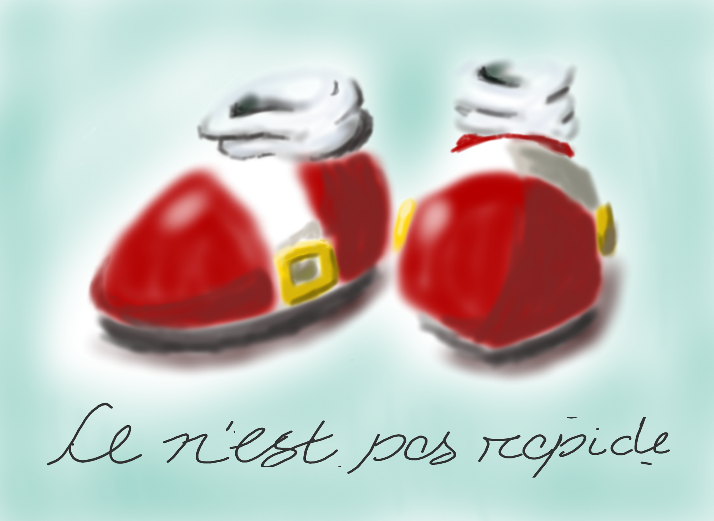

# The Treachery of Self-Image

What the hell is this? 

Well, back in 2018, I was bored and killing time. I decided to try to do some digital painting in Paint Tool Sai and wound up with this silly parody of Rene Magritte's "the Treachery of Images".

I had a lot of fun painting it. It was just dumb enough (both in concept and in execution) that I was constantly chuckling to myself. And at the end of it all, I liked how it turned out.

I'm making this page 6 years later and it's still pretty funny to me, but I'm also a bit embarrassed that it doesn't look quite as good as I remember thinking it did.

I also don't remember why I called it "the Treachery of Self-Image" aside from the obvious wordplay/parody of the source material. Why "self-image"? the world will never know.

Oh well, here it is.

